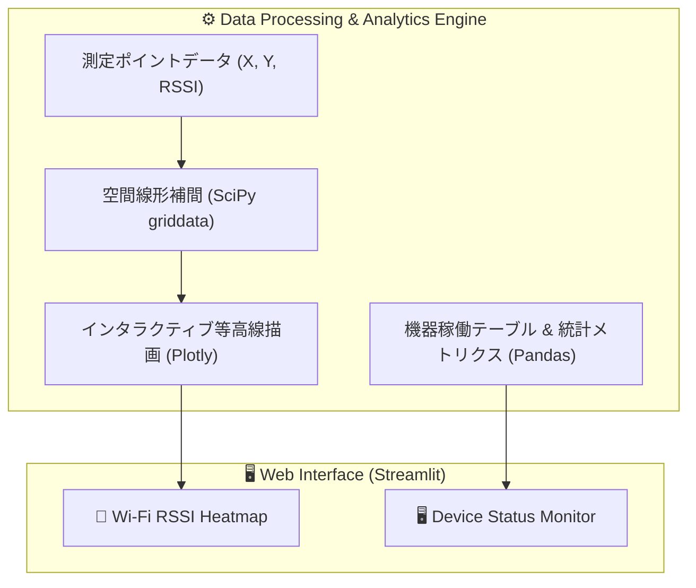

# 🌐 Network Ops Toolkit (net-ops-toolkit)

[](https://net-ops-toolkit.streamlit.app)
[](https://www.python.org/)
[](https://streamlit.io/)
[](https://plotly.com/)
[](LICENSE)

🔗 **Live Demo:** [https://net-ops-toolkit.streamlit.app](https://net-ops-toolkit.streamlit.app)

**Network Ops Toolkit** は、Wi-Fi電波環境の空間可視化とネットワーク機器の死活監視を一元管理できる、Python / Streamlitベースのインタラクティブ・ダッシュボードです。

小規模オフィス・店舗・現場環境におけるWi-Fiカバレッジ調査や、ネットワークインフラ（ルーター、PoEスイッチ、AP、NAS等）の稼働状況把握を直感的なWeb UIで行えます。

---

## 📸 機能概要 (Key Features)

### 1. 📶 Wi-Fi RSSI 空間補間ヒートマップ解析
- **空間線形補間（`scipy.interpolate.griddata`）**: 離散的な測定ポイントの電波強度（RSSI: dBm）から、フロア全体の電波分布を連続的に推定・マッピング。
- **インタラクティブな2D等高線描画（Plotly Contour）**: マウスホバーで各座標の電波強度を確認可能。測定点マーカーと測定値を重畳表示。
- **リアルタイム編集（`st.data_editor`）**: Web画面上のテーブルで測定座標やRSSI値を変更・追加すると、ヒートマップが即座に再レンダリング。

### 2. 🖥️ ネットワーク機器ステータス＆レイテンシ監視
- **稼働サマリーメトリクス**: 監視対象の総台数、正常稼働（Online）数、障害検知（Offline）数をリアルタイム集計。
- **ステータス別カラーハイライト**: 異常機器を赤色、正常機器を緑色で視覚的に強調表示。
- **レイテンシ（遅延時間）トラッキング**: 各機器への応答速度（ms）を可視化。

---

## 🏗️ システム構成＆データフロー (Architecture)



---

## 🛠️ 技術スタック (Tech Stack)

| カテゴリ | 採用技術 | バージョン | 役割 |
| :--- | :--- | :--- | :--- |
| **Language** | Python | 3.10+ | バックエンドロジック全般 |
| **Framework** | Streamlit | >= 1.35.0 | Web UIおよび状態管理 |
| **Data Processing** | Pandas, NumPy | >= 2.0.0, >= 1.24.0 | テーブルデータ操作・グリッド生成 |
| **Spatial Analysis**| SciPy | >= 1.10.0 | 2次元空間データの線形補間演算 |
| **Visualization** | Plotly | >= 5.20.0 | 等高線ヒートマップおよび散布図の描画 |
| **Deployment** | Streamlit Community Cloud | - | クラウドホスティング |

---

## 🚀 クイックスタート (Getting Started)

### 1. リポジトリのクローン
```bash
git clone https://github.com/Shuntaro1996/net-ops-toolkit.git
cd net-ops-toolkit
```

### 2. 依存パッケージのインストール
Python仮想環境（venv）の作成とアクティベートを推奨します。

```bash
# 仮想環境の作成と有効化 (Windows PowerShell)
python -m venv venv
.\venv\Scripts\Activate.ps1

# パッケージのインストール
pip install -r requirements.txt
```

### 3. ダッシュボードの起動
```bash
streamlit run app.py
```
ブラウザが自動的に開き、`http://localhost:8501` にてダッシュボードが表示されます。

---

## 🎯 主なユースケース (Use Cases)

1. **オフィス・店舗のWi-Fi不感地帯調査**
   - 端末で測定したフロア各所のRSSI値を入力し、電波が届きにくいエリアやAP増設が必要なポイントを特定。
2. **小規模ネットワークの簡易モニタリング**
   - 高価な統合監視ツールを導入せずに、主要機器の疎通状態と遅延をパッと一覧確認。
3. **Raspberry Piを活用した省電力エッジ監視サーバー**
   - ラズパイ上に本ツールを常駐させ、社内ローカルWebダッシュボードとして運用。

---

## 🗺️ 今後のロードマップ (Roadmap)

- [ ] **実機Ping疎通確認機能**: ICMP Pingによるステータス・レイテンシの自動定期更新
- [ ] **データ入出力対応**: 測定データおよび機器リストのCSV / JSONインポート・エクスポート
- [ ] **アラート通知連携**: 機器オフライン検知時のSlack / LINE / Email通知
- [ ] **フロア見取り図の背景重畳**: 実際のオフィスマップ画像上にヒートマップをオーバーレイ表示

---

## 👤 作成者 (Author)

- GitHub: [@Shuntaro1996](https://github.com/Shuntaro1996)

---

## 📄 ライセンス (License)

本プロジェクトは [MIT License](LICENSE) のもとで公開されています。
